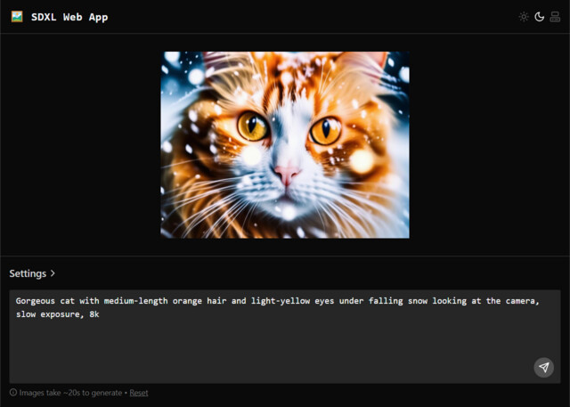

# sdxl-web-app

[](https://codespaces.new/adamelliotfields/sdxl-web-app?devcontainer_path=.devcontainer/devcontainer.json&machine=basicLinux32gb)
[](https://pr.new/adamelliotfields/sdxl-web-app)



A React app I made before I learned [Diffusers](https://github.com/huggingface/diffusers). It uses the Hugging Face [Inference API](https://huggingface.co/docs/api-inference/en/index) to generate images with [Stable Diffusion XL](https://stability.ai/news/stable-diffusion-sdxl-1-announcement).

That said, I don't plan on doing much more with it.

> [!NOTE]  
> Check out my [Spaces](https://huggingface.co/docs/hub/spaces) for Stable Diffusion [1.5](https://huggingface.co/spaces/adamelliotfields/diffusion) and [XL](https://huggingface.co/spaces/adamelliotfields/diffusion-xl). They run inference on serverless GPUs, support multiple models, and have more features like [Compel](https://github.com/damian0815/compel), [IP-Adapter](https://github.com/tencent-ailab/IP-Adapter), and [ControlNet](https://github.com/lllyasviel/ControlNet). They also have built-in upscaling with [Real-ESRGAN](https://github.com/xinntao/Real-ESRGAN). If you have a Nvidia GPU, you can run them locally.

## Usage

Set `VITE_HF_TOKEN` to your Hugging Face API key:

```sh
export VITE_HF_TOKEN='hf_...'

# or

echo "VITE_HF_TOKEN=$HF_TOKEN" > .env.local
```

Then run the app:

```sh
bun install
bun start
```
